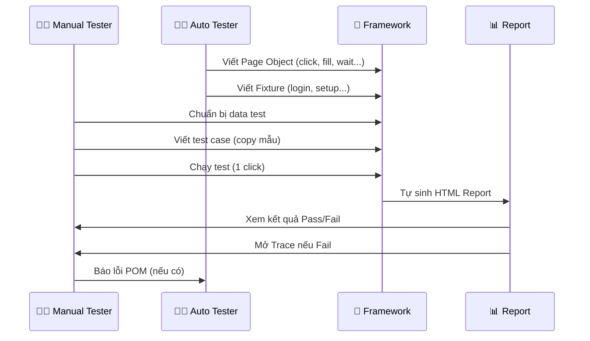

<!-- _class: lead -->
<!-- _paginate: skip -->

# 🎓 Đào Tạo Automation Testing

## **Buổi 1**
# Tổng quan Mô hình<br>Phối hợp Auto – Manual


<p class="small">🕐 2 giờ &nbsp;|&nbsp; 📅 2026 &nbsp;|&nbsp; 👤 ONEPAY JSC</p>

---

<!-- _class: default -->
# 📋 Agenda Buổi 1

| ⏱ | Phần | Nội dung |
|---|------|----------|
| 60' | **Phần 1** | Lý thuyết – Tại sao Manual cần Auto? |
| 30' | **Phần 2** | Cài đặt môi trường |
| 30' | **Phần 3** | Thực hành – Chạy test đầu tiên |

### 🎯 Mục tiêu
- ✅ Hiểu vai trò của Manual Tester trong dự án Automation
- ✅ Cài đặt được môi trường chạy test
- ✅ Chạy được 1 test case mẫu

---

# 🤔 Đặt vấn đề

<div style="display: grid; grid-template-columns: 1fr 1fr; gap: 1em; text-align: left;">

<div>

### 😫 Hiện tại
- Mỗi lần regression test lại **50-100 case** giống nhau
- Lặp đi lặp lại thao tác thủ công
- Dễ bỏ sót case
- Tốn nhiều thời gian

</div>

<div>

### 😎 Tương lai (có Automation)
- **Đổi data** → chạy ra kết quả ngay
- 1 file data chạy được **10 test case**
- Auto Tester viết framework
- Manual Tester **dùng framework** để viết data test

</div>

</div>

---

# 🔄 Quy trình phối hợp



---

# 🗂️ Kiến trúc thư mục dự án

<div style="text-align: left;">

```
project/
├── 📁 lib/                      ← Auto Tester viết
│   ├── pages/                   ← Page Object Model
│   ├── fixtures/                ← Login, setup test
│   └── utils/                   ← Hàm tiện ích
│
├── 📁 tests/                    ← 🤚 Manual Tester THAO TÁC CHÍNH
│   └── *.spec.ts
│
├── 📁 data/                     ← 🤚 Data test (Manual quản lý)
│   └── payment-data.ts
│
├── 📄 .env                      ← 🤚 Đổi ENV=dev42 → ENV=stg
├── 📄 playwright.config.ts      ← Auto Tester config
└── 📄 package.json
```

</div>

---

# 🟢🟠🔴 Phân vùng trách nhiệm

<div style="display: grid; grid-template-columns: 1fr 1fr; gap: 1em;">

<div style="background: #1b5e20; border-radius: 12px; padding: 1em;">

### 🟢 ĐƯỢC ĐỤNG VÀO
| Thư mục | Việc cần làm |
|---------|-------------|
| `tests/` | Viết test case |
| `data/` | Chuẩn bị data test |
| `.env` | Đổi môi trường |

</div>

<div style="background: #b71c1c; border-radius: 12px; padding: 1em;">

### 🔴 KHÔNG ĐỤNG VÀO
| Thư mục | Lý do |
|---------|-------|
| `lib/pages/` | Auto viết POM |
| `lib/fixtures/` | Login phức tạp |
| `playwright.config.ts` | Cấu hình sâu |

</div>

</div>

> 🧠 **Ghi nhớ:** Chỉ cần biết gọi đúng hàm với đúng kiểu dữ liệu!

---

# 👥 Phân định vai trò

| Nhiệm vụ | 👨‍💻 Auto | 👩‍💻 Manual |
|----------|:------:|:--------:|
| Viết Page Object (click, fill, wait...) | ✅ | ❌ |
| Viết hàm login, setup | ✅ | ❌ |
| Cấu hình Playwright | ✅ | ❌ |
| **Viết test case (`test()`)** | ✅ (mẫu) | ✅ **(chính)** |
| **Chuẩn bị data test (`data/`)** | ✅ (mẫu) | ✅ **(chính)** |
| Chạy test & xem report | ✅ | ✅ |
| Debug test failed (Trace Viewer) | ✅ | ✅ |
| Báo lỗi POM nếu thiếu hàm | ❌ | ✅ (báo Auto) |

---

# 🧠 Nguyên tắc vàng

<div style="display: flex; justify-content: center; align-items: center; height: 60%;">

> # *"Bạn không cần biết code sâu – chỉ cần biết **gọi đúng hàm với đúng kiểu dữ liệu**."*

</div>

---

# 🎬 Demo thực tế (15')

1. **Mở project demo** trên VS Code

2. **Mở file** `tests/demo-04-assertions.spec.ts`

3. **Chỉ ra từng phần:**
   - `test.describe()` là gì?
   - `test()` là gì?
   - Data truyền vào ở đâu?

4. **Chạy thử 1 test** từ Extension Playwright ▶️

5. **Mở HTML Report** xem kết quả

---

# 🛠️ Phần 2: Cài đặt môi trường

<div style="text-align: left;">

### 📦 Checklist (làm theo từng bước)

```bash
# 1️⃣ Kiểm tra NodeJS
node --version        # >= 18.x
npm --version         # >= 9.x

# 2️⃣ Kiểm tra Git
git --version

# 3️⃣ Clone project
git clone <repo-url> trainingAuto
cd trainingAuto

# 4️⃣ Cài dependencies
npm install

# 5️⃣ Cài Playwright browsers
npx playwright install chromium

# 6️⃣ Cài VS Code Extension
# Ctrl+Shift+X → "Playwright Test for VSCode" → Install
```

</div>

---

# 🩺 Troubleshooting thường gặp

| 🔴 Lỗi | 🔍 Nguyên nhân | 🟢 Cách fix |
|--------|--------------|-----------|
| `npm: command not found` | Chưa cài NodeJS | Cài từ https://nodejs.org |
| `EACCES` khi npm install | Quyền admin | Chạy terminal Administrator |
| Extension không thấy test | Sai workspace | Mở đúng folder gốc repo |
| Test không chạy | Thiếu `.env` | Copy `.env.example` → `.env` |

---

# 🏋️ Phần 3: Thực hành

<div style="display: grid; grid-template-columns: 1fr 1fr; gap: 1em;">

<div style="background: #1565c0; border-radius: 12px; padding: 1em;">

### 📝 Bài 1.1 (15')
**Mở project & chạy test mẫu**

1. VS Code → Open Folder → `trainingAuto`
2. Testing sidebar 🧪
3. Tìm 1 test case
4. Click ▶️ Play
5. Quan sát browser chạy
6. Xem kết quả Terminal

</div>

<div style="background: #2e7d32; border-radius: 12px; padding: 1em;">

### 📝 Bài 1.2 (15')
**Tự tạo project Playwright**

```bash
mkdir ~/playwright-practice
cd ~/playwright-practice
npm init -y
npm install @playwright/test
npx playwright install chromium
```

```ts
// tests/demo.spec.ts
test('Google có title đúng', async ({ page }) => {
  await page.goto('https://google.com');
  await expect(page).toHaveTitle(/Google/);
});
```

</div>

</div>

---

# 📋 Đầu ra buổi 1

<div style="text-align: left; font-size: 1.2em;">

- [ ] ✅ Mở được project automation trong VS Code

- [ ] ✅ Chạy được 1 test case có sẵn qua Extension

- [ ] ✅ Biết `lib/` (không đụng) vs `tests/` (được đụng)

- [ ] ✅ Tự tạo được project Playwright trống từ đầu

</div>

---

<!-- _class: lead -->
<!-- _paginate: skip -->

# 🎉 Hết Buổi 1

### Câu hỏi? 🤔

### 👉 Buổi 2: Đọc hiểu Test Case & Xem Báo cáo
