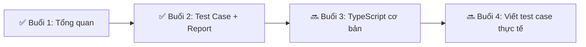

<!-- _class: lead -->
<!-- _paginate: skip -->

# 🎓 Đào Tạo Automation Testing

## **Buổi 2**
# Đọc hiểu Cấu trúc Test Case<br>& Xem Báo cáo


<p class="small">🕐 2 giờ &nbsp;|&nbsp; 📅 2026 &nbsp;|&nbsp; 👤 ONEPAY JSC</p>

---

<!-- _class: default -->
# 📋 Agenda Buổi 2

| ⏱ | Phần | Nội dung |
|---|------|----------|
| 45' | **Phần 1** | Lý thuyết – Cấu trúc test case |
| 30' | **Phần 2** | Đọc & phân tích HTML Report |
| 45' | **Phần 3** | Thực hành – Debug với Trace Viewer |
| – | **🏠 Về nhà** | Bài tập làm quen & phân tích |

### 🎯 Mục tiêu
- ✅ Hiểu cấu trúc `test()` và `test.describe()`
- ✅ Đọc & phân tích được HTML Report
- ✅ Debug được test failed với Trace Viewer

---

# 🗂️ `test.describe()` – Nhóm test case

<div style="display: grid; grid-template-columns: 1fr 1fr; gap: 0.5em; text-align: left; font-size: 0.9em;">

<div>

### 🧠 Tư duy
**1 màn hình = 1 `test.describe()`**

```ts
test.describe('Quản lý giao dịch', () => {
  // Các test trong đây đều
  // thuộc màn hình
  // "Quản lý giao dịch"
});
```

</div>

<div>

### 📊 Mapping Manual → Code

| Manual Test Case | Code |
|---|---|
| Module: Quản lý GD | `test.describe('QLGD'` |
| └ Case 1: Tìm theo mã | `test('Tìm theo mã'` |
| └ Case 2: Tìm theo ngày | `test('Tìm theo ngày'` |
| └ Case 3: Xem chi tiết | `test('Xem chi tiết'` |

</div>

</div>

---

# 🔬 Giải phẫu 1 `test()` hoàn chỉnh

<div style="text-align: left;">

```typescript
//  ①   ②                                          ③
test('Tên test case - mô tả tiếng Việt', async ({ page, login }) => {
  //   ④

  // ARRANGE – Chuẩn bị
  await login('iportal');
  await navigateTo('Merchant Management');

  // ACT – Hành động
  await page.fill('[placeholder="Nhập từ khóa"]', 'TEST ONEPAY');
  await page.click('button:has-text("Tìm kiếm")');

  // ASSERT – Kiểm tra
  await expect(page.locator('.merchant-name')).toContainText('TEST ONEPAY');
});
```

</div>

| ① | ② | ③ | ④ |
|---|---|---|---|
| `test(...)` | `'Tên case'` | `{ page, login }` | Code trong `{}` |
| Định nghĩa test | Mô tả (tiếng Việt) | Công cụ (`page`=browser, `login`=đăng nhập) | Các bước AAA |

---

# 🧱 Pattern AAA – "Xương sống" mọi test case

<div style="display: flex; justify-content: center; gap: 0.3em; font-size: 0.8em;">

<div style="background:#1565c0; border-radius:12px; padding:1em; flex:1;">

### 📦 ARRANGE
### *Chuẩn bị*
- Login
- Điều hướng menu
- Chuẩn bị data

</div>

<div style="font-size:2em; display:flex; align-items:center;">➡️</div>

<div style="background:#e65100; border-radius:12px; padding:1em; flex:1;">

### 🎬 ACT
### *Thực hiện*
- `page.click()`
- `page.fill()`
- `page.selectOption()`

</div>

<div style="font-size:2em; display:flex; align-items:center;">➡️</div>

<div style="background:#2e7d32; border-radius:12px; padding:1em; flex:1;">

### ✅ ASSERT
### *Kiểm tra*
- `expect().toBeVisible()`
- `expect().toContainText()`
- `expect().toHaveCount()`

</div>

</div>

---

# 🧩 Bài tập AAA (không code)

<div style="text-align: left;">

### Quy trình: "Tạo giao dịch thanh toán"

| # | Bước Manual | AAA? |
|---|------------|:----:|
| 1 | Đăng nhập iPortal | **Arrange** |
| 2 | Vào menu Tạo giao dịch | **Arrange** |
| 3 | Điền số tiền: 100,000đ | Act |
| 4 | Chọn phương thức: Ví điện tử | Act |
| 5 | Click "Tạo giao dịch" | Act |
| 6 | Kiểm tra thông báo "Thành công" | **Assert** |
| 7 | Kiểm tra GD xuất hiện trong danh sách | **Assert** |

</div>

---

# 🛠️ Các hàm Manual Tester cần biết

| Hàm | Mục đích | Ví dụ |
|-----|----------|-------|
| `page.goto(url)` | Mở URL | `await page.goto('https://...')` |
| `page.click(sel)` | Click element | `await page.click('button:has-text("Lưu")')` |
| `page.fill(sel, val)` | Nhập text | `await page.fill('#amount', '100000')` |
| `page.selectOption(sel, val)` | Chọn dropdown | `await page.selectOption('#bank', 'VCB')` |
| `page.waitForSelector(sel)` | Chờ element xuất hiện | `await page.waitForSelector('.success-msg')` |

---

# ✅ Các hàm Assertion Manual Tester cần biết

| Hàm | Mục đích | Ví dụ |
|-----|----------|-------|
| `expect(loc).toBeVisible()` | Element hiển thị? | `await expect(page.locator('.msg')).toBeVisible()` |
| `expect(loc).toContainText(t)` | Có chứa text? | `await expect(page.locator('.msg')).toContainText('TC')` |
| `expect(loc).toHaveText(t)` | Text chính xác? | `await expect(page.locator('h1')).toHaveText('Title')` |
| `expect(loc).toHaveCount(n)` | Đúng số lượng? | `await expect(page.locator('li')).toHaveCount(3)` |
| `expect(loc).toHaveValue(v)` | Input có giá trị? | `await expect(page.locator('#inp')).toHaveValue('abc')` |
| `expect(loc).toBeEnabled()` | Đang enable? | `await expect(page.locator('button')).toBeEnabled()` |

---

# 📊 Phần 2: HTML Report

<div style="text-align: left;">

### 🖥️ Cách tạo report

```bash
npx playwright test                    # Chạy test → tự sinh report
npx playwright show-report             # Xem lại report cũ
```

### 📁 Report nằm ở đâu?

```
playwright-report/
└── index.html         ← Mở file này bằng browser
```

</div>

---

# 📊 Giao diện HTML Report

<div style="background:#1e1e1e; border-radius:12px; padding:1em; text-align:left; font-family:monospace;">

```
┌─────────────────────────────────────────────────────┐
│  PLAYWRIGHT HTML REPORT                             │
│                                                     │
│  📊 15/18 passed  🔴 3 failed  ⏭ 0 skipped         │
│  ⏱ Tổng: 2m 34s                                    │
│                                                     │
│  ✅ test('Tìm kiếm giao dịch')               12s    │
│  ✅ test('Tạo giao dịch mới')                 45s    │
│  ❌ test('Xóa giao dịch')                     8s     │
│  ✅ test('Lọc theo ngày')                     15s    │
│  ...                                                 │
└─────────────────────────────────────────────────────┘
```

</div>

---

# 🔍 Thông tin quan trọng trong Report

| Thành phần | Ý nghĩa | Hành động |
|-----------|---------|-----------|
| **Tổng quan** | Pass / Fail / Skip | Đánh giá tình trạng chung |
| **Thời gian** | Test nào chậm | Báo Auto Tester tối ưu |
| **Error message** | Lý do fail | Copy gửi Auto Tester |
| **Screenshot** | Ảnh chụp lúc fail | Xem UI lúc lỗi |
| **Video** | Quay lại toàn bộ test | Xem lại flow |
| ⭐ **TRACE** | Timeline từng bước | **QUAN TRỌNG NHẤT** |

---

# 🔁 Quy trình khi gặp test FAILED

<div style="display: flex; flex-direction: column; gap: 0.5em; text-align: left;">

```
① Nhìn dòng error message → hiểu lỗi gì

② Mở Screenshot → thấy UI lúc lỗi

③ Mở Trace → xem từng bước test đã làm gì

④ Kết luận: Lỗi do data? UI thay đổi? Môi trường?

⑤ Hành động: Sửa data → hoặc báo Auto nếu lỗi POM
```

</div>

---

# 🩺 Các lỗi thường gặp & cách xử lý

| 🔴 Error Message | 🔍 Nguyên nhân | 👤 Người xử lý |
|-----------------|---------------|:------------:|
| `Timeout 30000ms exceeded` | Element không xuất hiện (UI đổi) | 👨‍💻 Auto |
| `locator.click: element not visible` | Button bị ẩn / che | 👨‍💻 Auto |
| `expect(...).toContainText(...)` | **Data mong đợi ≠ thực tế** | 👩‍💻 **Manual** |
| `net::ERR_CONNECTION_REFUSED` | Server chết | 👥 Cả team |
| `toHaveTitle: expected A ≠ B` | Sai URL / trang | 👩‍💻 **Manual** |

---

# 🔬 Trace Viewer – "Kính hiển vi" debug

<div style="display: grid; grid-template-columns: 1fr 1fr; gap: 1em; text-align: left;">

<div>

### 📋 Trace cho bạn biết:
- ✅ Từng **step** test đã chạy
- ✅ **Screenshot** trước/sau mỗi step
- ✅ **Network request** gửi đi
- ✅ **Console log** của browser
- ✅ **Giá trị thực tế** vs mong đợi

</div>

<div>

### 🖥️ Cách mở Trace

```bash
# Mở trace từ file zip
npx playwright show-trace \
  test-results/.../trace.zip
```

### 🖥️ Hoặc từ HTML Report
Click vào test failed → tab **Trace**

</div>

</div>

---

# 🏋️ Bài tập 2.1: Đọc hiểu test case (15')

<div style="text-align: left; font-size: 0.75em;">

```typescript
test.describe('Quản lý giao dịch', () => {

  test('Tìm kiếm giao dịch theo mã tham chiếu', async ({ page, login }) => {
    await login('iportal');
    await page.goto('/payment/search');

    await page.fill('#refNo', 'PAY123456');
    await page.click('button:has-text("Tìm kiếm")');

    await expect(page.locator('.result-row')).toBeVisible();
    await expect(page.locator('.ref-no')).toContainText('PAY123456');
  });

  test('Tìm kiếm với mã không tồn tại', async ({ page, login }) => {
    await login('iportal');
    await page.goto('/payment/search');

    await page.fill('#refNo', 'XYZ999999');
    await page.click('button:has-text("Tìm kiếm")');

    await expect(page.locator('.no-data')).toBeVisible();
  });
});
```

</div>

### ❓ Trả lời:
1. Module này test chức năng gì?
2. Có bao nhiêu test case? Mỗi case làm gì?
3. Đâu là Arrange? Act? Assert?
4. Nếu TC1 failed với `toContainText`, nguyên nhân có thể là gì?

---

# 🏋️ Bài tập 2.2: Debug test failed (20')

<div class="xsmall">

### Bước 1: Chạy test → thấy pass
```bash
npx playwright test transaction.spec.ts
```

### Bước 2: Cố tình làm fail
```ts
// SỬA dòng này:
await expect(page.locator('.ref-no')).toContainText('PAY123456');
//   ↓ THÀNH ↓
await expect(page.locator('.ref-no')).toContainText('SAI_DATA');
```

### Bước 3: Chạy lại → FAILED
```bash
npx playwright test transaction.spec.ts
```

### Bước 4: Mở Trace Viewer
```bash
npx playwright show-trace test-results/.../trace.zip
```

### Bước 5: Phân tích trace
- 🔍 Xem từng step (click, fill, assert)
- 📸 Xem screenshot trước/sau mỗi step
- 🎯 Tìm đúng step gây lỗi
- 📊 So sánh giá trị thực tế vs mong đợi

</div>

---

# 📋 Đầu ra buổi 2

<div style="text-align: left; font-size: 1.1em;">

- [ ] ✅ Đọc hiểu được cấu trúc `test.describe()` và `test()`

- [ ] ✅ Nhận diện được 3 phần **Arrange – Act – Assert**

- [ ] ✅ Tạo và mở được **HTML Report** sau khi chạy test

- [ ] ✅ Khi test failed, biết mở **Trace Viewer** tìm nguyên nhân

- [ ] ✅ Phân biệt lỗi **data** (tự sửa) vs lỗi **POM** (báo Auto)

</div>

---

# 🗺️ Lộ trình sau 2 buổi đầu



---

# 🎯 Tổng kết 2 buổi đầu

<div style="display: grid; grid-template-columns: 1fr 1fr; gap: 0.8em; font-size: 0.8em;">

<div style="background:#2e7d32; border-radius:12px; padding:0.8em;">

### ✅ Đã làm được

Có project chạy trên máy

Chạy test = 1 click

Đọc hiểu code test

Xem report Pass/Fail

Debug bằng Trace Viewer

</div>

<div style="background:#1565c0; border-radius:12px; padding:0.8em;">

### 🔜 Sắp tới

**Buổi 3:** TypeScript cơ bản

**Buổi 4+:** Viết test thực tế

</div>

</div>

---

# 🏠 Bài tập về nhà

<div style="display: grid; grid-template-columns: 1fr 1fr; gap: 0.6em; text-align: left;">

<div style="background:#1565c0; border-radius:10px; padding:0.6em;">

### 📝 Bài 1:

Mở file `demo-06-page-actions.spec.ts` → trả lời:

1. Module này test chức năng gì?
2. Có bao nhiêu `test()`? Mỗi test làm gì?
3. Đánh dấu **A-A-A** vào 1 test bất kỳ
4. Tìm 1 dòng `expect()` và giải thích

</div>

<div style="background:#2e7d32; border-radius:10px; padding:0.6em;">

### 📝 Bài 2:

Chạy file `demo-05-failure-debug.spec.ts` → mở Report → chụp:

1. 📸 Ảnh tổng quan (pass/fail)
2. 📸 Ảnh 1 test PASS (thời gian, steps)
3. 📸 Ảnh 1 test FAIL (error message)
4. 📸 Ảnh Trace của test failed

</div>

</div>

---

# 🏠 Bài tập về nhà 

<div style="display: grid; grid-template-columns: 1fr 1fr; gap: 0.6em; text-align: left;">

<div style="background:#e65100; border-radius:10px; padding:0.6em;">

### 📝 Bài 3: 

Sửa 1 dòng `expect()` trong `demo-02-aaa-pattern.spec.ts` sai data → chạy lại → trả lời:

1. ✍️ Error message nói gì?
2. ✍️ Screenshot lúc fail hiển thị gì?
3. ✍️ Trace: step nào gây lỗi?
4. ✍️ Lỗi do **data** hay do **action**?

</div>

</div>

<br>

> 📁 **Nộp bài:** Tất cả để trong folder `Result/`, push lên nhánh GitHub của mỗi người.

---

<!-- _class: lead -->
<!-- _paginate: skip -->

# 🎉 Hết Buổi 2

### Cảm ơn! 🙏

### Câu hỏi? 🤔
